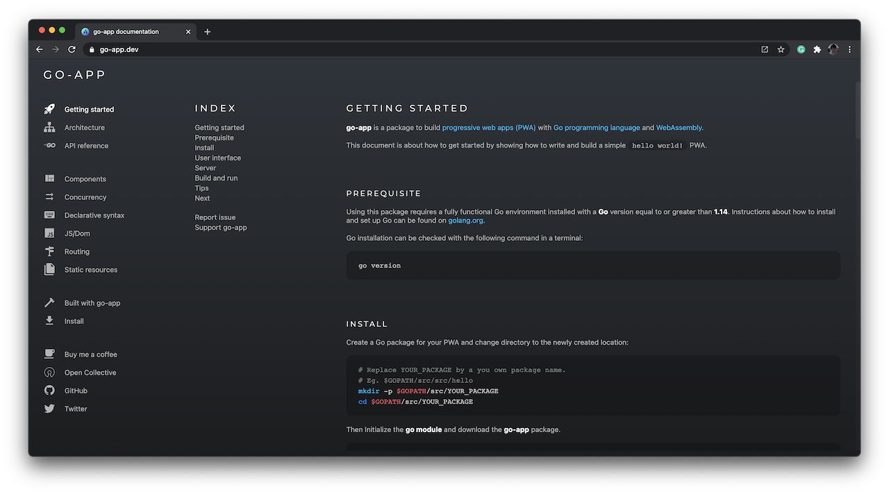

<h1 align="center">
    <a href="https://go-app.dev">
        
    </a>
</h1>

<p align="center">
	<a href="https://circleci.com/gh/maxence-charriere/go-app"></a>
    <a href="https://goreportcard.com/report/github.com/maxence-charriere/go-app"></a>
	<a href="https://GitHub.com/maxence-charriere/go-app/releases/"></a>
	<a href="https://pkg.go.dev/github.com/maxence-charriere/go-app/v8/pkg/app"></a>
    <a href="https://twitter.com/jonhymaxoo"></a>
    <a href="https://opencollective.com/go-app" alt="Financial Contributors on Open Collective"></a>
</p>

Go-app is a package for **building progressive web apps (PWA)** with the [Go programming language (Golang)](https://golang.org) and [WebAssembly (Wasm)](https://webassembly.org).

Shaping a UI is done by using a **[declarative syntax](https://go-app.dev/syntax) that creates and compose HTML elements only by using the Go programing language**.

It **uses [Go HTTP standard](https://golang.org/pkg/net/http) model**.

An app created with go-app can out of the box **run in its own window**, **supports offline mode**, and are **SEO friendly**.

## Documentation

[](https://go-app.dev)

## Install

**go-app** requirements:

- [Go 1.14](https://golang.org/doc/go1.14) or newer
- [Go module](https://github.com/golang/go/wiki/Modules)

```sh
go mod init
go get -u github.com/maxence-charriere/go-app/v8/pkg/app
```

## Declarative syntax

Go-app uses a [declarative syntax](https://go-app.dev/syntax) so you can **write reusable component-based UI elements** just by using the Go programming language.

Here is a Hello World component that takes an input and displays its value in its title:

```go
type hello struct {
	app.Compo

	name string
}

func (h *hello) Render() app.UI {
	return app.Div().Body(
		app.H1().Body(
			app.Text("Hello, "),
			app.If(h.name != "",
				app.Text(h.name),
			).Else(
				app.Text("World!"),
			),
		),
		app.P().Body(
			app.Input().
				Type("text").
				Value(h.name).
				Placeholder("What is your name?").
				AutoFocus(true).
				OnChange(h.ValueTo(&h.name)),
		),
	)
}
```

## Standard HTTP

Apps created with go-app complies with [Go standard HTTP](https://golang.org/pkg/net/http) package interfaces.

```go
func main() {
    // Components routing:
	app.Route("/", &hello{})
	app.Route("/hello", &hello{})
	app.RunWhenOnBrowser()

    // HTTP routing:
	http.Handle("/", &app.Handler{
		Name:        "Hello",
		Description: "An Hello World! example",
	})

	if err := http.ListenAndServe(":8000", nil); err != nil {
		log.Fatal(err)
	}
}
```

## Getting started

**Read the [Getting Started](https://go-app.dev/start) document**.

## Contributors

### Code Contributors

This project exists thanks to all the people who contribute. [[Contribute](CONTRIBUTING.md)].

<a href="https://github.com/maxence-charriere/go-app/graphs/contributors"></a>

### Financial Contributors

Become a financial contributor and help us sustain [go-app](https://github.com/maxence-charriere/go-app) development. [[Contribute](https://opencollective.com/go-app/contribute)]

#### Individuals

<a href="https://opencollective.com/go-app"></a>

#### Organizations

Support this project with your organization. Your logo will show up here with a link to your website. [[Contribute](https://opencollective.com/go-app/contribute)]

<a href="https://opencollective.com/go-app/organization/0/website"></a>
<a href="https://opencollective.com/go-app/organization/1/website"></a>
<a href="https://opencollective.com/go-app/organization/2/website"></a>
<a href="https://opencollective.com/go-app/organization/3/website"></a>
<a href="https://opencollective.com/go-app/organization/4/website"></a>
<a href="https://opencollective.com/go-app/organization/5/website"></a>
<a href="https://opencollective.com/go-app/organization/6/website"></a>
<a href="https://opencollective.com/go-app/organization/7/website"></a>
<a href="https://opencollective.com/go-app/organization/8/website"></a>
<a href="https://opencollective.com/go-app/organization/9/website"></a>
